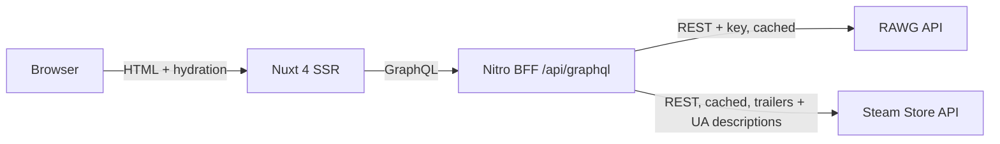

# GG Stay

[](https://github.com/Sennjen/gg-stay/actions/workflows/ci.yml)

A server-rendered video game catalog built for Ukrainian players: Ukrainian-first interface, practical filters, and a GraphQL layer over the [RAWG](https://rawg.io) API.

**Live:** https://gg-stay.vercel.app

## Status

Week 1 (skeleton: catalog, game detail, Ukrainian and English UI, CI, preview
deployments) is done, and so is the visual redesign: a cinematic landing
page, a cover-first catalog with a filter drawer, and a restyled game page
share one dark design system (tokens and component inventory in
[DESIGN.md](DESIGN.md)). Steam trailers (with a RAWG-clip fallback) and
Ukrainian game descriptions (from each title's Steam store page, where one
exists) are live.

| Next   | Scope                                                                               |
| ------ | ----------------------------------------------------------------------------------- |
| Week 2 | Nightly Steam index (UAH prices, Ukrainian localisation), SEO, Lighthouse CI        |
| Week 3 | Natural-language search with validated structured output and deterministic fallback |
| Week 4 | Cross-store prices                                                                  |

## Architecture



- The browser never calls RAWG or Steam directly; both API surfaces are only reached from the server.
- Resolvers are thin: `filterToParams` → `rawgFetch` → `postFilter` → `mappers`. RAWG field names stop at the mapper.
- Both upstreams go through one transport (`createUpstreamFetch`): a rate limiter, a 5 s timeout, one retry on 5xx or timeout, an LRU-bounded cache and stale-if-error. RAWG is parameterised at 4 rps with per-path TTLs (lists 10 min, detail 24 h, taxonomies 7 days); Steam at one request per 1.5 s with a flat 24 h TTL. Errors name their own upstream.
- All catalog filter state lives in the URL, parsed and serialised by pure functions.

## Landing page

- A full-bleed hero: the featured game's poster is the LCP element, with an
  optional Steam or RAWG trailer that loads after the page goes idle, muted,
  looping, with a visible pause control and a static poster fallback under
  `prefers-reduced-motion`.
- A cover ring of the catalog's most-added titles — pause on hover, drag or
  arrow-key rotation, click through to a game page; a static marquee below
  768 px and under reduced motion.
- "Why GG Stay", new-releases and top-rated rows, and a closing call to action.

## Catalog and game page

- A slide-out filter drawer (left panel ≥ 1024 px, bottom sheet below):
  platform, genre, year range, Metacritic, player rating, playtime, game
  mode, age rating, store and developer, all as active filter chips.
- A header search with a debounced instant-results dropdown, keyboard
  navigable, that reuses the catalog's own search query.
- Grid or list view (a local preference, not part of the URL).
- The game page carries a scoreboard row, a keyboard- and screen-reader-
  accessible screenshot gallery/lightbox, and store links.

Decisions are recorded in [docs/adr](docs/adr); the week 1 design is in
[docs/specs](docs/specs); the redesign design is in
[docs/specs/2026-09-19-redesign-design.md](docs/specs/2026-09-19-redesign-design.md).

## Performance

Lighthouse (mobile) is measured on `/`, `/games` and a game page after each
performance change lands, with the report and numbers recorded in
[docs/perf](docs/perf/README.md). That file also carries the measured
first-load JavaScript for `/games` (131.1 KB gzipped, 117.5 KB brotli) against
the 120 KB budget ADR-002 set, chunk by chunk, and what is left to move.

## Development

```bash
pnpm install
cp .env.example .env   # RAWG_FIXTURES=1 serves recorded fixtures, no API key needed
pnpm dev
```

| Command                           | Purpose                                                |
| --------------------------------- | ------------------------------------------------------ |
| `pnpm test`                       | Unit, component and SSR tests (no network access)      |
| `pnpm typecheck`                  | `vue-tsc` over app and server                          |
| `pnpm lint` / `pnpm format:check` | ESLint and Prettier                                    |
| `pnpm codegen`                    | Regenerate GraphQL types; CI fails when they are stale |

## Security

- **The GraphQL endpoint is public and cost-limited.** Operations are rejected before execution — and therefore before any upstream call — when they select more than 12 root fields, nest deeper than 7 levels, or repeat `game`/`games`/`landing` more than three times; the rejection is a GraphQL error with `extensions.code: "QUERY_TOO_COMPLEX"` inside an HTTP 200, like every other error this endpoint produces. Query batching is refused, and introspection is off in production.
- **Third-party URLs are scheme-checked.** RAWG game websites, store links and trailer URLs are partly publisher-submitted; `safeExternalUrl` allows only `http:`/`https:`, applied in the mappers so an unsafe value never enters a response, and again at the two templates that bind them to `href`.
- **Security headers on every route.** `X-Content-Type-Options`, `Referrer-Policy`, `Permissions-Policy` and `X-Frame-Options` come from `routeRules`, so the CDN applies them to static assets too. The **Content-Security-Policy has exactly one source** — a Nitro plugin (`server/plugins/csp.ts`), deliberately not `routeRules`: the Vercel preset compiles a `routeRules` header into a proxy-level rule, and a hash-free `script-src 'self'` applied there would block the scripts Nuxt inlines and leave every page unhydrated in production. The policy is scoped to this app's real origins (`media.rawg.io` and the `api.rawg.io` host it redirects to for images; Steam's video CDN plus `blob:` for the HLS trailer, which hls.js attaches as a MediaSource object URL; self-hosted fonts). `script-src` carries sha256 hashes of the two scripts Nuxt inlines, computed per response, so it never needs `'unsafe-inline'`; `style-src` does, because Nuxt inlines each route's critical CSS and there is no hook to hash it without a module. `/api/graphql` sets its own `default-src 'none'` in the route handler, because yoga's response never passes through the plugin's hook; CDN-served static assets carry the four static headers and no policy of their own.
- **Steam HTML is stripped, never interpolated as markup** — a hand-written linear scanner (`server/steam/description.ts`) whose output only ever reaches text interpolation.

## Known gaps

- Player rating, playtime and age rating filters are applied after fetching a page, because RAWG has no query parameters for them. A filtered page can hold fewer than 20 games and the total count reflects the unfiltered query.
- Selecting several game modes widens the result set rather than narrowing it, because RAWG treats comma-separated tags as OR.
- The response cache is in memory per server instance, LRU-bounded at 500 entries, until the shared Redis store lands in week 2.
- Fixture mode ignores filters that RAWG would apply server-side.
- Steam trailer URLs carry a signed query string; how long that signature stays valid is undocumented by Steam, so a cached trailer link could go stale before its own cache entry expires. Not yet observed in practice.
- There are no prices yet — `PriceSummary`/`StoreOffer` price fields exist in the schema but resolve to `null` until the nightly Steam index (week 2) fills them in.

## Attribution

Game data and images are provided by [RAWG](https://rawg.io) and [Steam](https://store.steampowered.com). Names and images belong to their respective owners. On the Ukrainian site, the game description comes from Steam's Ukrainian store page when the publisher provides one; otherwise it falls back to RAWG's English text.

## License

MIT
