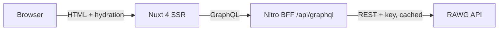

# GG Stay

[](https://github.com/Sennjen/gg-stay/actions/workflows/ci.yml)

A server-rendered video game catalog built for Ukrainian players: Ukrainian-first interface, practical filters, and a GraphQL layer over the [RAWG](https://rawg.io) API.

**Live:** https://gg-stay.vercel.app

## Status

Week 1 of 4 — skeleton: catalog, game detail, Ukrainian and English UI, CI, preview deployments.

| Next   | Scope                                                                                      |
| ------ | ------------------------------------------------------------------------------------------ |
| Week 2 | Nightly Steam index (UAH prices, Ukrainian localisation), home shelves, SEO, Lighthouse CI |
| Week 3 | Natural-language search with validated structured output and deterministic fallback        |
| Week 4 | Cross-store prices                                                                         |

## Architecture



- The browser never calls RAWG; the API key lives only on the server.
- Resolvers are thin: `filterToParams` → `rawgFetch` → `postFilter` → `mappers`. RAWG field names stop at the mapper.
- `rawgFetch` adds a 4 rps limiter, a 5 s timeout, one retry on 5xx or timeout, a cache (lists 10 min, detail 24 h, taxonomies 7 days) and stale-if-error.
- All catalog filter state lives in the URL, parsed and serialised by pure functions.

Decisions are recorded in [docs/adr](docs/adr); the week 1 design is in [docs/specs](docs/specs).

## Development

```bash
pnpm install
cp .env.example .env   # RAWG_FIXTURES=1 serves recorded fixtures, no API key needed
pnpm dev
```

| Command                           | Purpose                                                |
| --------------------------------- | ------------------------------------------------------ |
| `pnpm test`                       | Unit, component and SSR tests (no network access)      |
| `pnpm typecheck`                  | `vue-tsc` over app and server                          |
| `pnpm lint` / `pnpm format:check` | ESLint and Prettier                                    |
| `pnpm codegen`                    | Regenerate GraphQL types; CI fails when they are stale |

## Known gaps

- Player rating, playtime and age rating filters are applied after fetching a page, because RAWG has no query parameters for them. A filtered page can hold fewer than 20 games and the total count reflects the unfiltered query.
- Selecting several game modes widens the result set rather than narrowing it, because RAWG treats comma-separated tags as OR.
- The response cache is in memory per server instance until the shared Redis store lands in week 2.
- Fixture mode ignores filters that RAWG would apply server-side.

## Attribution

Game data and images are provided by [RAWG](https://rawg.io). Names and images belong to their respective owners.

## License

MIT
