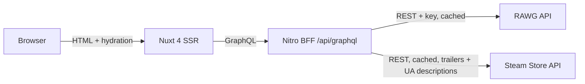

# GG Stay

[](https://github.com/Sennjen/gg-stay/actions/workflows/ci.yml)

A server-rendered video game catalog built for Ukrainian players: Ukrainian-first interface, practical filters, and a GraphQL layer over the [RAWG](https://rawg.io) API.

**Live:** https://gg-stay.vercel.app

## Status

Week 1 (skeleton: catalog, game detail, Ukrainian and English UI, CI, preview
deployments) is done, and so is the visual redesign: a cinematic landing
page, a cover-first catalog with a filter drawer, and a restyled game page
share one dark design system (tokens and component inventory in
[DESIGN.md](DESIGN.md)). Steam trailers (with a RAWG-clip fallback) and
Ukrainian game descriptions (from each title's Steam store page, where one
exists) are live.

| Next   | Scope                                                                               |
| ------ | ----------------------------------------------------------------------------------- |
| Week 2 | Nightly Steam index (UAH prices, Ukrainian localisation), SEO, Lighthouse CI        |
| Week 3 | Natural-language search with validated structured output and deterministic fallback |
| Week 4 | Cross-store prices                                                                  |

## Architecture


```mermaid
flowchart LR
  B[Browser] -->|HTML + hydration| N[Nuxt 4 SSR]
  N -->|GraphQL| G[Nitro BFF /api/graphql]
  G -->|REST + key, cached| R[RAWG API]
  G -->|REST, cached, trailers + UA descriptions| S[Steam Store API]
```

- The browser never calls RAWG or Steam directly; both API surfaces are only reached from the server.
- Resolvers are thin: `filterToParams` → `rawgFetch` → `postFilter` → `mappers`. RAWG field names stop at the mapper.
- Both upstreams go through one transport (`createUpstreamFetch`): a rate limiter, a 5 s timeout, one retry on 5xx or timeout, an LRU-bounded cache and stale-if-error. RAWG is parameterised at 4 rps with per-path TTLs (lists 10 min, detail 24 h, taxonomies 7 days); Steam at one request per 1.5 s with a flat 24 h TTL. Errors name their own upstream.
- All catalog filter state lives in the URL, parsed and serialised by pure functions.

## Landing page

- A full-bleed hero: the featured game's poster is the LCP element, with an
  optional Steam or RAWG trailer that loads after the page goes idle, muted,
  looping, with a visible pause control and a static poster fallback under
  `prefers-reduced-motion`.
- A cover ring of the catalog's most-added titles — pause on hover, drag or
  arrow-key rotation, click through to a game page; a static marquee below
  768 px and under reduced motion.
- "Why GG Stay", new-releases and top-rated rows, and a closing call to action.

## Catalog and game page

- A slide-out filter drawer (left panel ≥ 1024 px, bottom sheet below):
  platform, genre, year range, Metacritic, player rating, playtime, game
  mode, age rating, store and developer, all as active filter chips.
- A header search with a debounced instant-results dropdown, keyboard
  navigable, that reuses the catalog's own search query.
- Grid or list view (a local preference, not part of the URL).
- The game page carries a scoreboard row, a keyboard- and screen-reader-
  accessible screenshot gallery/lightbox, and store links.

Decisions are recorded in [docs/adr](docs/adr); the week 1 design is in
[docs/specs](docs/specs); the redesign design is in
[docs/specs/2026-09-19-redesign-design.md](docs/specs/2026-09-19-redesign-design.md).

## Search engines

- Every page has a title ending in "— GG Stay" (the landing keeps its own), a description in the
  page's language, a canonical link without the query string, the uk/en hreflang pair, Open Graph
  and Twitter tags. The game page describes itself with the description it shows (the Ukrainian
  Steam text on `/games/…`), and emits `VideoGame` JSON-LD; the landing emits `WebSite` with a
  catalog `SearchAction`. A filtered or paginated catalog page is `noindex, follow`.
- `/sitemap.xml` indexes `/sitemaps/static.xml` and `/sitemaps/games-<n>.xml`, built from the
  published price index, with `xhtml:link` alternates for both locales; cached for six hours.
  `robots.txt` keeps crawlers off `/api/` and names the sitemap.
- `NUXT_PUBLIC_SITE_URL` must be a bare `http(s)` origin; the build fails on anything else
  (`shared/siteUrl.ts`). It is required on a Vercel production build, where it must also be a
  public `https` origin. A Vercel preview without it uses its own deployment host (`VERCEL_URL`),
  and every preview response carries `X-Robots-Tag: noindex, nofollow`. Elsewhere (local, CI,
  tests) it falls back to `http://localhost:3000`. Do not set `NUXT_PUBLIC_I18N_BASE_URL`: it
  would override the validated value at runtime without being checked.
- The landing's share card, `public/og.png`, is drawn from the design tokens by
  `scripts/og-image.ts` (`pnpm build && pnpm exec tsx scripts/og-image.ts`).

## Performance

Lighthouse (mobile) is measured on `/`, `/games` and a game page after each
performance change lands, with the report and numbers recorded in
[docs/perf](docs/perf/README.md). That file also carries the measured
first-load JavaScript for `/games` (131.1 KB gzipped, 117.5 KB brotli) against
the 120 KB budget ADR-002 set, chunk by chunk, and what is left to move.

Every pull request also runs quality gates against a fixture-mode production
build started in CI: the `/games` JavaScript budget (today's size plus 5 %),
Playwright smoke flows with axe accessibility checks, and Lighthouse CI with
per-page thresholds — see
[docs/perf](docs/perf/README.md#quality-gates-in-ci).

## Field metrics

Lighthouse measures one machine; the field numbers come from real visitors
through [Vercel Speed Insights](https://vercel.com/docs/speed-insights).

- **What is collected:** the Core Web Vitals of each page view — LCP, INP,
  CLS, FCP and TTFB — grouped by route pattern (`/games/[slug]`, not each
  game; `/en/…` separately; error pages and unknown addresses as `/404` or
  `/error`), together with the page address and the coarse context Vercel
  records with every report (device type, browser, country), as described in
  Vercel's Speed Insights privacy documentation.
- **What is not:** no cookies and no identifiers of any kind are set or sent
  by this app. Query strings and fragments are removed from the reported
  address before a report leaves the browser (the report request itself, like
  any same-origin request, still carries the full page address in its
  `Referer` header). A visitor whose browser sends Do Not Track or Global
  Privacy Control is not measured at all: the script is never requested.
- **How it loads:** `app/plugins/speed-insights.client.ts` imports the
  Speed Insights SDK after hydration, when the browser is idle, from its own
  chunk that is never preloaded or prefetched. The first-load JavaScript of
  `/games` grew by the loader alone (0.4 KB gzipped); the SDK (1 KB gzipped)
  is downloaded only by visitors who are measured. A visitor who leaves
  before the page first goes idle is never measured, so the numbers lean
  slightly towards longer visits. The script
  (`/_vercel/speed-insights/script.js`) and its reports
  (`/_vercel/speed-insights/vitals`) are same-origin, so the existing
  Content-Security-Policy covers both.
- **Where the numbers are:** the project's **Speed Insights** tab in the
  Vercel dashboard (p75 per route, per device, over time). They are not
  published from this repository.
- **When it is on:** by default in Vercel production builds only
  (`VERCEL_ENV=production` at build time; Speed Insights is enabled for the
  project). Preview deployments are left out so they never mix into the
  production numbers; local and CI builds load nothing; fixture mode is never
  measured, whether it is set at build time or at runtime.
  `NUXT_PUBLIC_SPEED_INSIGHTS=0` turns it off at runtime and `=1` forces it
  on (except in fixture mode).
- **Checking a deployment:** the page source carries `speedInsights:"1"` in
  its `__NUXT__` config, and after the page settles a
  `<script src="/_vercel/speed-insights/script.js">` sits in `<head>`. The
  value is decided when the deployment is built: promoting a preview to
  production, or rolling back to one, keeps the preview's off — set
  `NUXT_PUBLIC_SPEED_INSIGHTS=1` for such a deployment, or redeploy. A project
  that does not expose Vercel's system environment variables to the build
  never turns it on by itself either.

## Natural-language search

`POST /api/ask` `{ q, locale }` turns a description — "кооператив для двох на
Switch до 500 грн" — into the catalog filter it means and a short ranked list
with one reason per game, using Claude Haiku 4.5 through the official
Anthropic SDK (`server/ask/`). Two model calls per question: one maps the
query to a filter (re-validated against the live taxonomy, then run through
the same resolvers as `/games`), one orders up to 40 candidates.

- **Privacy:** the query text is sent to Anthropic to be answered. It is not
  stored with the visitor's IP address: the address is used only for the
  per-address rate limit, in memory, and the server log records counts,
  latency, tokens, cost and mode — never the address and never the query.
  Answers are cached in memory for 24 hours by query text, locale and index
  version, with no visitor data.
- **Limits:** 10 questions per address per minute; a per-instance daily
  ceiling of model calls (`ASK_DAILY_LLM_CALLS`, default 500); queries up to
  200 characters; 500/900 output tokens, an 8 s timeout and one retry per
  call; a 12 s budget per question. The hard cap on spend is the monthly limit
  set in the Anthropic Console.
- **Fallback:** without `ANTHROPIC_API_KEY`, past the ceiling, or on any
  error, refusal or timeout, the answer is `mode: "fallback"` — the raw query
  as a plain catalog search — never an error page.
- **Fixture mode** (`RAWG_FIXTURES=1`) answers from recorded responses
  (`tests/fixtures/ask/recorded.json`) and never calls the API.

## Development

```bash
pnpm install
cp .env.example .env   # RAWG_FIXTURES=1 serves recorded fixtures, no API key needed
pnpm dev
```

| Command                           | Purpose                                                |
| --------------------------------- | ------------------------------------------------------ |
| `pnpm test`                       | Unit, component and SSR tests (no network access)      |
| `pnpm typecheck`                  | `vue-tsc` over app and server                          |
| `pnpm lint` / `pnpm format:check` | ESLint and Prettier                                    |
| `pnpm codegen`                    | Regenerate GraphQL types; CI fails when they are stale |
| `pnpm e2e`                        | Playwright flows + axe against a built app (below)     |
| `pnpm check:bundle-budget`        | `/games` first-load JS against its gzip budget         |
| `pnpm exec lhci autorun`          | Lighthouse CI against a built app                      |

The last three run against a production build in fixture mode:
`RAWG_FIXTURES=1 NITRO_PRESET=node-server NUXT_PUBLIC_SITE_URL=http://localhost:3000 pnpm build`,
then `RAWG_FIXTURES=1 NUXT_RAWG_FIXTURES=1 node .output/server/index.mjs`. Playwright starts that
server itself; set `QUALITY_REUSE_SERVER=1` to run it against one already listening.
`QUALITY_BASE_URL` points all three at another address.

## Security

- **The GraphQL endpoint is public and cost-limited.** Operations are rejected before execution — and therefore before any upstream call — when they select more than 12 root fields, nest deeper than 7 levels, or repeat `game`/`games`/`landing` more than three times; the rejection is a GraphQL error with `extensions.code: "QUERY_TOO_COMPLEX"` inside an HTTP 200, like every other error this endpoint produces. Query batching is refused, and introspection is off in production.
- **Third-party URLs are scheme-checked.** RAWG game websites, store links and trailer URLs are partly publisher-submitted; `safeExternalUrl` allows only `http:`/`https:`, applied in the mappers so an unsafe value never enters a response, and again at the two templates that bind them to `href`.
- **Security headers on every route.** `X-Content-Type-Options`, `Referrer-Policy`, `Permissions-Policy` and `X-Frame-Options` come from `routeRules`, so the CDN applies them to static assets too. The **Content-Security-Policy has exactly one source** — a Nitro plugin (`server/plugins/csp.ts`), deliberately not `routeRules`: the Vercel preset compiles a `routeRules` header into a proxy-level rule, and a hash-free `script-src 'self'` applied there would block the scripts Nuxt inlines and leave every page unhydrated in production. The policy is scoped to this app's real origins (`media.rawg.io` and the `api.rawg.io` host it redirects to for images; Steam's video CDN plus `blob:` for the HLS trailer, which hls.js attaches as a MediaSource object URL; self-hosted fonts). `script-src` carries sha256 hashes of the two scripts Nuxt inlines, computed per response, so it never needs `'unsafe-inline'`; `style-src` does, because Nuxt inlines each route's critical CSS and there is no hook to hash it without a module. Pages also allow, through `'unsafe-hashes'` and its hash, the one inline event handler `<NuxtImg>` renders (`onerror="this.setAttribute('data-error', 1)"`), and no other. `/api/graphql` sets its own `default-src 'none'` in the route handler, because yoga's response never passes through the plugin's hook; CDN-served static assets carry the four static headers and no policy of their own.
- **Steam HTML is stripped, never interpolated as markup** — a hand-written linear scanner (`server/steam/description.ts`) whose output only ever reaches text interpolation.

## Known gaps

- Player rating, playtime and age rating filters are applied after fetching a page, because RAWG has no query parameters for them. A filtered page can hold fewer than 20 games and the total count reflects the unfiltered query.
- Selecting several game modes widens the result set rather than narrowing it, because RAWG treats comma-separated tags as OR.
- The response cache is in memory per server instance, LRU-bounded at 500 entries, until the shared Redis store lands in week 2.
- Fixture mode ignores filters that RAWG would apply server-side.
- Steam trailer URLs carry a signed query string; how long that signature stays valid is undocumented by Steam, so a cached trailer link could go stale before its own cache entry expires. Not yet observed in practice.
- There are no prices yet — `PriceSummary`/`StoreOffer` price fields exist in the schema but resolve to `null` until the nightly Steam index (week 2) fills them in.

## Attribution

Game data and images are provided by [RAWG](https://rawg.io) and [Steam](https://store.steampowered.com). Names and images belong to their respective owners. On the Ukrainian site, the game description comes from Steam's Ukrainian store page when the publisher provides one; otherwise it falls back to RAWG's English text.

## License

MIT
