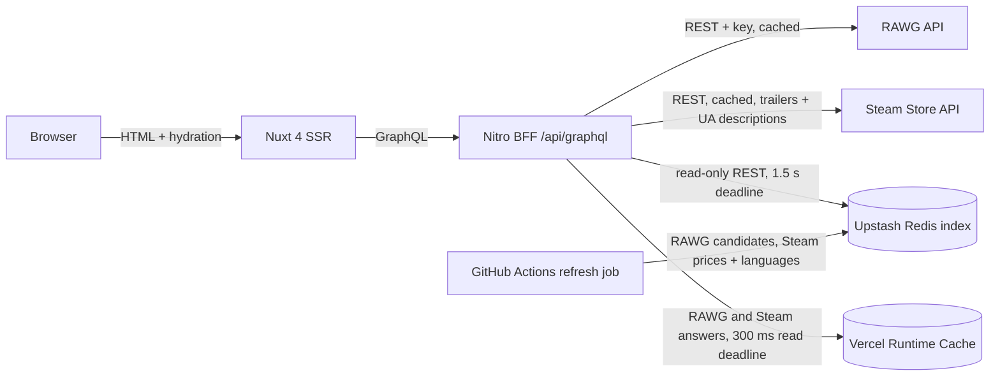

# GG Stay

[](https://github.com/Sennjen/gg-stay/actions/workflows/ci.yml)

A server-rendered video game catalog built for Ukrainian players: Ukrainian-first interface, practical filters, hryvnia prices and Ukrainian localisation from Steam, and a GraphQL layer over the [RAWG](https://rawg.io) API.

**Live:** https://gg-stay.vercel.app

## Status

Weeks 1–3 are done. Week 1 was the skeleton (catalog, game detail, Ukrainian
and English UI, CI, preview deployments) and the visual redesign: a landing
page, a cover-first catalog with a filter drawer, and a restyled game page
share one dark design system (tokens and component inventory in
[DESIGN.md](DESIGN.md)), with Steam trailers (and a RAWG-clip fallback) and
Ukrainian game descriptions from each title's Steam store page, where one
exists.

| Done since | What exists now                                                                                                                                         |
| ---------- | ------------------------------------------------------------------------------------------------------------------------------------------------------- |
| Week 2     | A price index of about 3 270 games: Steam prices in UAH, discounts and Ukrainian localisation on cards and game pages, with filters and sorts over them |
| Week 2     | A made-in-Ukraine shelf, label and filter built from a list of 25 studios; similar games on the game page                                               |
| Week 2     | Page metadata, JSON-LD and sitemaps; Vercel Speed Insights; CI quality gates (bundle budget, Playwright with axe, Lighthouse CI)                        |
| Week 3     | Natural-language search at `/ask`                                                                                                                       |

| Next   | Scope              |
| ------ | ------------------ |
| Week 4 | Cross-store prices |

## Architecture


```mermaid
flowchart LR
  B[Browser] -->|HTML + hydration| N[Nuxt 4 SSR]
  N -->|GraphQL| G[Nitro BFF /api/graphql]
  G -->|REST + key, cached| R[RAWG API]
  G -->|REST, cached, trailers + UA descriptions| S[Steam Store API]
  G -->|read-only REST, 1.5 s deadline| I[(Upstash Redis index)]
  G -->|RAWG and Steam answers, 300 ms read deadline| C[(Vercel Runtime Cache)]
  J[GitHub Actions refresh job] -->|RAWG candidates, Steam prices + languages| I
```

- The browser never calls RAWG or Steam directly; both API surfaces are only reached from the server.
- Resolvers are thin: `filterToParams` → `rawgFetch` → `postFilter` → `mappers`. RAWG field names stop at the mapper.
- Prices, discounts, Ukrainian localisation, the made-in-Ukraine flag and similar games come from a faceted Redis index that a scheduled GitHub Actions job rebuilds (prices every six hours, the whole index nightly) and the site reads with a read-only token. A catalog page filtered or sorted by any of those is answered by the index alone; every other page is answered by RAWG with the index data attached, and by the index when RAWG has not answered within 2.5 s and the index can express the filter. No page fails when the index does. The decision is recorded in [ADR-004](docs/adr/004-price-index.md).
- Both upstreams go through one transport (`createUpstreamFetch`): a rate limiter, a 5 s timeout, one retry on 5xx or timeout, an LRU-bounded cache and stale-if-error. RAWG is parameterised at 4 rps with per-path TTLs (lists 10 min, detail 24 h, taxonomies 7 days); Steam at one request per 1.5 s with a flat 24 h TTL. On the site RAWG's limiter also has a burst of three (`RAWG_BURST`): after a pause three requests leave together, so the three a game page asks for no longer wait a quarter of a second for each other, and the rate after that is the same 4 rps. RAWG publishes no per-second limit, so this is a trial on production: a 429 in the function log (`RATE_LIMITED (429)`) is the sign to set it back to 1. The refresh job and Steam have no burst. Errors name their own upstream.
- On Vercel that cache has two levels ([design](docs/specs/2026-10-09-shared-upstream-cache-design.md)): the instance's memory, and behind it Vercel's Runtime Cache, which every instance of the function shares and a deployment does not empty. It takes only answers that are fresh for a day or longer and that no visitor typed — a game's pages, the taxonomies, the landing's lists, Steam's page about an app, and the live Steam price of a game page; a ten-minute catalog list and anything searched for stay in memory alone, as before. Memory answers first; the shared level is read only on a miss or an expired entry, for at most 300 ms, and written without being waited for. What RAWG says about a game — its detail, store links and screenshots — is fresh for 24 h and is then served as stored for up to a week while it is refreshed behind the answer; nothing else is served stale while it is refreshed: past its lifetime a list, a taxonomy or Steam's page about an app is asked for again and waited for, with the old copy standing in only when the upstream fails (stale-if-error, as before — now from another instance's copy too), and a price is never served past its own. Off Vercel, and in fixture mode, there is memory alone and no stale window.
- All catalog filter state lives in the URL, parsed and serialised by pure functions.

## Landing page

- A full-bleed hero: the featured game's poster is the LCP element, with an
  optional Steam or RAWG trailer that loads after the page goes idle, muted,
  looping, with a visible pause control and a static poster fallback under
  `prefers-reduced-motion`.
- A cover ring of the catalog's most-added titles — pause on hover, drag or
  arrow-key rotation, click through to a game page; a static marquee below
  768 px and under reduced motion.
- "Why GG Stay", up to five shelves — made in Ukraine, with Ukrainian
  localisation, on sale (30 % off or more), best of this year, upcoming — each
  linking to the catalog page it is the start of, and a closing call to
  action. A shelf with fewer than four games is not shown.

## Catalog and game page

- A slide-out filter drawer (left panel ≥ 1024 px, bottom sheet below):
  price, discount, Ukrainian localisation, made in Ukraine, platform, genre,
  year range, Metacritic, player rating, playtime, game mode, age rating,
  store and developer, all as active filter chips. Sorting by price or
  discount comes with them.
- Cards show the Steam price in hryvnia, the discount, a Ukrainian
  localisation badge and a made-in-Ukraine label for the games the index
  holds ([ADR-004](docs/adr/004-price-index.md)); a page the index answers
  says under its result count that it searched only those games.
- A header search with a debounced instant-results dropdown, keyboard
  navigable, that reuses the catalog's own search query.
- Grid or list view (a local preference, not part of the URL).
- The game page carries a scoreboard row with the price and the localisation,
  a keyboard- and screen-reader-accessible screenshot gallery/lightbox, store
  links, and a row of similar games when the index has at least four.

Decisions are recorded in [docs/adr](docs/adr); the design of each cycle is in
[docs/specs](docs/specs).

## Search engines

- Every page has a title ending in "— GG Stay" (the landing keeps its own), a description in the
  page's language, a canonical link without the query string, the uk/en hreflang pair, Open Graph
  and Twitter tags. The game page describes itself with the description it shows (the Ukrainian
  Steam text on `/games/…`), and emits `VideoGame` JSON-LD; the landing emits `WebSite` with a
  catalog `SearchAction`. A filtered or paginated catalog page is `noindex, follow`.
- `/sitemap.xml` indexes `/sitemaps/static.xml` and `/sitemaps/games-<n>.xml`, built from the
  published price index, with `xhtml:link` alternates for both locales; cached for six hours.
  `robots.txt` keeps crawlers off `/api/` and names the sitemap.
- `NUXT_PUBLIC_SITE_URL` must be a bare `http(s)` origin; the build fails on anything else
  (`shared/siteUrl.ts`). It is required on a Vercel production build, where it must also be a
  public `https` origin. A Vercel preview without it uses its own deployment host (`VERCEL_URL`),
  and every preview response carries `X-Robots-Tag: noindex, nofollow`. Elsewhere (local, CI,
  tests) it falls back to `http://localhost:3000`. Do not set `NUXT_PUBLIC_I18N_BASE_URL`: it
  would override the validated value at runtime without being checked.
- The landing's share card, `public/og.png`, is drawn from the design tokens by
  `scripts/og-image.ts` (`pnpm build && pnpm exec tsx scripts/og-image.ts`).

## Performance

Lighthouse (mobile) is measured on production after each performance change
lands, with the reports and numbers recorded in
[docs/perf](docs/perf/README.md). The latest run (2026-10-05, median of three):

| Page                                    | Performance | LCP   | CLS   |
| --------------------------------------- | ----------- | ----- | ----- |
| `/` (landing)                           | 92          | 3.2 s | 0     |
| `/games`                                | 95          | 2.7 s | 0     |
| `/games/[slug]`                         | 93          | 2.9 s | 0.001 |
| `/games?priceMaxUah=600&sort=PRICE_ASC` | 94          | 2.8 s | 0     |
| `/ask`                                  | 99          | 1.7 s | 0     |

Accessibility and best practices are 100 on all five. The first-load
JavaScript of `/games` is 142 828 bytes gzipped (139.5 KiB) against the CI
budget of 144 633 bytes; the 120 KB target ADR-002 set is still missed and
recorded there. A catalog page waits at most 2.5 s for RAWG before the index
answers it instead, when the index can express the filter.

The game page works inside a time budget of its own
([design](docs/specs/2026-10-06-game-page-budget-design.md)): a game the index
holds is answered from the index when RAWG has not answered within 2.5 s, and
the page asks again by itself for what was left out. Every `/api/graphql`
answer says where its time went in a `Server-Timing` header —
`rawg;dur=5012;desc="RAWG x3", index;dur=41;desc="Index x2", total;dur=5020` —
one entry per upstream the request called, with its slowest call in
milliseconds (limiter queue and retry included) and the number of calls; a
cached answer is not a call, and neither is an index read that sent nothing to
the store. A request that read the shared cache names it too —
`cache;dur=12;desc="Cache 3 of 3"`, its slowest read and how many of its reads
found what answered — which tells a first open that another instance's work
answered from one that asked RAWG; an answer out of the instance's own memory
is no read, and a read is named even when the answer went out before RAWG did.
The browser's network panel shows it under Timing for the requests
the browser makes itself: a game opened from the catalog or by any other
client-side navigation, and a partial page's own retries. A hard load asks
inside the server render, and that answer's header stays on the server — the
document carries none, so a slow first open shows only in the function log.

Every pull request also runs quality gates against a fixture-mode production
build started in CI: the `/games` JavaScript budget (today's size plus 5 %),
Playwright smoke flows with axe accessibility checks, and Lighthouse CI with
per-page thresholds — see
[docs/perf](docs/perf/README.md#quality-gates-in-ci).

## Field metrics

Lighthouse measures one machine; the field numbers come from real visitors
through [Vercel Speed Insights](https://vercel.com/docs/speed-insights).

- **What is collected:** the Core Web Vitals of each page view — LCP, INP,
  CLS, FCP and TTFB — grouped by route pattern (`/games/[slug]`, not each
  game; `/en/…` separately; error pages and unknown addresses as `/404` or
  `/error`), together with the page address and the coarse context Vercel
  records with every report (device type, browser, country), as described in
  Vercel's Speed Insights privacy documentation.
- **What is not:** no cookies and no identifiers of any kind are set or sent
  by this app. Query strings and fragments are removed from the reported
  address before a report leaves the browser (the report request itself, like
  any same-origin request, still carries the full page address in its
  `Referer` header). A visitor whose browser sends Do Not Track or Global
  Privacy Control is not measured at all: the script is never requested.
- **How it loads:** `app/plugins/speed-insights.client.ts` imports the
  Speed Insights SDK after hydration, when the browser is idle, from its own
  chunk that is never preloaded or prefetched. The first-load JavaScript of
  `/games` grew by the loader alone (0.4 KB gzipped); the SDK (1 KB gzipped)
  is downloaded only by visitors who are measured. A visitor who leaves
  before the page first goes idle is never measured, so the numbers lean
  slightly towards longer visits. The script
  (`/_vercel/speed-insights/script.js`) and its reports
  (`/_vercel/speed-insights/vitals`) are same-origin, so the existing
  Content-Security-Policy covers both.
- **Where the numbers are:** the project's **Speed Insights** tab in the
  Vercel dashboard (p75 per route, per device, over time). They are not
  published from this repository.
- **When it is on:** by default in Vercel production builds only
  (`VERCEL_ENV=production` at build time; Speed Insights is enabled for the
  project). Preview deployments are left out so they never mix into the
  production numbers; local and CI builds load nothing; fixture mode is never
  measured, whether it is set at build time or at runtime.
  `NUXT_PUBLIC_SPEED_INSIGHTS=0` turns it off at runtime and `=1` forces it
  on (except in fixture mode).
- **Checking a deployment:** the page source carries `speedInsights:"1"` in
  its `__NUXT__` config, and after the page settles a
  `<script src="/_vercel/speed-insights/script.js">` sits in `<head>`. The
  value is decided when the deployment is built: promoting a preview to
  production, or rolling back to one, keeps the preview's off — set
  `NUXT_PUBLIC_SPEED_INSIGHTS=1` for such a deployment, or redeploy. A project
  that does not expose Vercel's system environment variables to the build
  never turns it on by itself either.

## Natural-language search

How it works, how answers are ranked and the full path of checks behind it:
[ADR-003](docs/adr/003-natural-language-search.md).

`POST /api/ask` `{ q, locale }` turns a description — "кооператив для двох на
Switch до 500 грн" — into the catalog filter it means and a short ranked list
with one reason per game, using Claude Haiku 4.5 through the official
Anthropic SDK (`server/ask/`). Two model calls per question: one maps the
query to a filter (re-validated against the live taxonomy) plus up to three
mood tags, one picks up to 8 of the 24 most relevant candidates and says why
each fits. The candidates come from the price and localisation index whenever
it can express everything understood — almost always, in a fraction of a
second; only a title search goes to RAWG. If RAWG has not answered within
2.5 s the index's own name match answers it; with no such match RAWG gets up
to 4 s and one attempt, after which the index answers the rest and names the
dropped field. The answer
is `{ mode, interpretation, filter, catalogUrl, items: [{ card, reason }],
ignoredFilters, indexStale, indexedOnly, matchedTags, tookMs }`:
`ignoredFilters`, `indexStale` and `indexedOnly` mean what they mean on a
catalog page (`indexedOnly`: the cards are from the index's games alone), and
are `false`/empty when no page answered.

- **Mood tags:** words the catalog has no filter for — "горор", "рогалик",
  "затишна" — become RAWG tags from a fixed list of 48 (`shared/moodTags.ts`).
  The refresh job stores every one of them a game has (`moodTags`) and files
  the game under an index facet per tag (`f:tag:{slug}`); the ask retrieval
  prefers games with every tag, then the most defining one. The catalog link
  stays tag-free, and the answer names the tags it also matched on in
  `matchedTags`. Documents published before the job mapped them have none, so
  until the next full refresh run a tag query falls back to the filter alone.
- **Reasons** say something about the game itself — setting, mechanics, tone,
  length — never the filter back: a reason with a price, a platform name or a
  schema code is dropped.

- **Privacy:** the query text is sent to Anthropic to be answered. The
  application does not store it with the visitor's IP address: the address is
  used only for the per-address limits, in memory, and the application log
  records counts, latency per step, tokens, cost and mode — never the address
  and never the query. Answers are cached in memory by query text, locale and index
  version, with no visitor data. A shared `/ask?q=…` link carries the query in
  its URL, and the hosting platform's own request logs record URLs together
  with addresses, as they do for every page.
- **Limits:** 10 questions per address per minute and 40 model-backed answers
  per address per UTC day (cached answers are free); a per-instance daily
  ceiling of model calls (`ASK_DAILY_LLM_CALLS`, default 500); queries up to
  200 characters; 500/1 200 output tokens, an 8 s timeout and one retry per
  call; one 15 s deadline per request, fallback search included, with the
  rerank given 7 s from the end of the parse (never past 14 s). The hard cap
  on spend is the account's prepaid credit balance, which does not reload by
  itself.
- **Fallback:** without `ANTHROPIC_API_KEY`, past a limit, once the credits
  run out, or on any error, refusal or timeout of the parse, the answer is
  `mode: "fallback"` — the raw query as a plain search over the index's game
  names (RAWG only if the index is down) — never an
  error page. A failed ranking keeps the understood filter and serves its
  games in catalog order; filters the catalog could not apply are listed in
  `ignoredFilters`.
- **Fixture mode** (`RAWG_FIXTURES=1`) answers from recorded responses
  (`tests/fixtures/ask/recorded.json`) and never calls the API.

## Development

```bash
pnpm install
cp .env.example .env   # RAWG_FIXTURES=1 serves recorded fixtures, no API key needed
pnpm dev
```

| Command                           | Purpose                                                |
| --------------------------------- | ------------------------------------------------------ |
| `pnpm test`                       | Unit, component and SSR tests (no network access)      |
| `pnpm typecheck`                  | `vue-tsc` over app and server                          |
| `pnpm lint` / `pnpm format:check` | ESLint and Prettier                                    |
| `pnpm codegen`                    | Regenerate GraphQL types; CI fails when they are stale |
| `pnpm e2e`                        | Playwright flows + axe against a built app (below)     |
| `pnpm check:bundle-budget`        | `/games` first-load JS against its gzip budget         |
| `pnpm exec lhci autorun`          | Lighthouse CI against a built app                      |

The last three run against a production build in fixture mode:
`RAWG_FIXTURES=1 NITRO_PRESET=node-server NUXT_PUBLIC_SITE_URL=http://localhost:3000 pnpm build`,
then `RAWG_FIXTURES=1 NUXT_RAWG_FIXTURES=1 node .output/server/index.mjs`. Playwright starts that
server itself; set `QUALITY_REUSE_SERVER=1` to run it against one already listening.
`QUALITY_BASE_URL` points all three at another address.

## Security

- **The GraphQL endpoint is public and cost-limited.** Operations are rejected before execution — and therefore before any upstream call — when they select more than 12 root fields, nest deeper than 7 levels, or repeat `game`/`games`/`landing` more than three times; the rejection is a GraphQL error with `extensions.code: "QUERY_TOO_COMPLEX"` inside an HTTP 200, like every other error this endpoint produces. Query batching is refused, and introspection is off in production.
- **Third-party URLs are scheme-checked.** RAWG game websites, store links and trailer URLs are partly publisher-submitted; `safeExternalUrl` allows only `http:`/`https:`, applied in the mappers so an unsafe value never enters a response, and again at the two templates that bind them to `href`.
- **Security headers on every route.** `X-Content-Type-Options`, `Referrer-Policy`, `Permissions-Policy` and `X-Frame-Options` come from `routeRules`, so the CDN applies them to static assets too. The **Content-Security-Policy has exactly one source** — a Nitro plugin (`server/plugins/csp.ts`), deliberately not `routeRules`: the Vercel preset compiles a `routeRules` header into a proxy-level rule, and a hash-free `script-src 'self'` applied there would block the scripts Nuxt inlines and leave every page unhydrated in production. The policy is scoped to this app's real origins (`media.rawg.io` and the `api.rawg.io` host it redirects to for images; Steam's video CDN plus `blob:` for the HLS trailer, which hls.js attaches as a MediaSource object URL; self-hosted fonts). `script-src` carries sha256 hashes of the two scripts Nuxt inlines, computed per response, so it never needs `'unsafe-inline'`; `style-src` does, because Nuxt inlines each route's critical CSS and there is no hook to hash it without a module. Pages also allow, through `'unsafe-hashes'` and its hash, the one inline event handler `<NuxtImg>` renders (`onerror="this.setAttribute('data-error', 1)"`), and no other. `/api/graphql` sets its own `default-src 'none'` in the route handler, because yoga's response never passes through the plugin's hook; CDN-served static assets carry the four static headers and no policy of their own.
- **Steam HTML is stripped, never interpolated as markup** — a hand-written linear scanner (`server/steam/description.ts`) whose output only ever reaches text interpolation.
- **Nothing the site caches holds the RAWG API key.** A RAWG list comes with links to its neighbouring pages that repeat the request's address, key and search term included; the site cuts them to the bare address before the answer is kept anywhere — in an instance's memory or in the cache the instances share, whose keys are hashes (`server/rawg/paginationLinks.ts`).

## Known gaps

- On a page RAWG answers, the player rating, playtime and age rating filters are applied after fetching the page, because RAWG has no query parameters for them: such a page can hold fewer than 20 games and its total reflects the unfiltered query. A page the index answers applies them exactly.
- Selecting several game modes widens the result set rather than narrowing it: RAWG treats comma-separated tags as OR, and the index unites the values of one facet the same way.
- The index holds about 3 270 games — the 3 000 most popular on RAWG plus the games of the 25 listed Ukrainian studios. Price, discount, localisation and made-in-Ukraine filters, the price sorts and similar games search only those, and a game outside the index shows no price on its card.
- When RAWG is slower than 2.5 s, page 1 of a catalog can come from the index and page 2 from RAWG a moment later. Their order and totals differ, so a game can repeat or be skipped and the pager's total can move.
- A game page waits for RAWG only as long as its budget: 1.5 s for the store links and screenshots of any game, and 2.5 s for the game itself when the index holds it. Past that it goes out with what it has, says so in one line, and asks again by itself after 3 s and once more 6 s later. For a game outside the index — the long tail beyond the 3 270 — the game itself is still waited for as long as RAWG takes, two attempts of 5 s each, and the page fails when RAWG does; its store links and screenshots are cut at 1.5 s like any other's, so its page can go out partial too, and so can the page of a Steam game the index does not hold when only its live price was late. A page whose two retries both come back partial, or fail, says that the rest did not load and stays as it is until it is reloaded.
- A partial page is the whole page for whoever does not run its scripts: a crawler that takes the server's HTML, or a browser without JavaScript, keeps it without the description, the other stores or most of the screenshots, and with JSON-LD that lacks the fields they fill. The sentence about loading is not in that HTML. How often it happens has not been measured: before the budget six of thirty first opens took longer than 2.5 s, and every partial page writes a `[game]` line to the function log, which is where the share can be read.
- A partial page's two retries ask RAWG again even when RAWG is refusing: one view of an indexed game can send nine requests to a RAWG answering 429 where it used to send three, bounded by the two attempts and the limiter's four requests a second per instance, after its burst of three. A page RAWG answered is partial as well when RAWG refused its store links or its screenshots for rate (a 429): it goes out without them, says so in one `[game]` line and asks again, so one view of any game can send seven requests to such a RAWG where it sent three. Any other failure of theirs still leaves the page complete without them, and nothing asks again. The same holds for Steam and a game the index does not hold: with Steam failing, one view asks it six times where it used to ask twice.
- The Ukrainian description is waited for 1.5 s and never asked for again: when Steam is slower — or the request is still queued behind Steam's one request per 1.5 s per instance, as it is for the third cold game page in a row — that view shows RAWG's English text, is not marked partial, and gets the Ukrainian text only on a later view.
- What RAWG and Steam answer about a game, the taxonomies and the landing's lists are shared by every instance of the function through Vercel's Runtime Cache; the rest is still per instance. A catalog list RAWG answers (fresh for ten minutes) and every search — the catalog's, the header's suggestions, the developer filter's — are kept by the instance that asked, so a new instance asks RAWG for them again. Each instance has its own memory level (LRU-bounded at 500 entries for each upstream), its own limiter (four RAWG requests a second after a burst of three, one Steam request per 1.5 s), and its own requests in flight: a game page's own retry finds what its first request left running only when it reaches the same instance, and two instances can refresh the same stale answer at the same time. Index-served catalog pages and `/ask` answers are kept in memory alone. A cold function start still costs the instance's own start — about 1.5 s of the 3–4.7 s measured before the shared cache; what the shared cache saves of the rest has not been measured on production yet.
- A game's description, store links and screenshots from RAWG can be up to a week old: past 24 h they are served as stored and refreshed behind the answer, so a change at RAWG reaches the page one view late. What comes from Steam — the Ukrainian description, the trailer — is asked for again once it is a day old, and its old copy is shown only if Steam then fails. A refresh is not started while the instance's queue of RAWG requests is more than two seconds long, so a burst of stale pages is answered and refreshed a few at a time, on later views. A refresh that fails leaves the old copy in place until it is a week old, and so does one that finds the game gone: a game RAWG has removed keeps its page for up to a week, where it used to fail after a day.
- The shared cache is best effort. A read of it that fails or takes longer than 300 ms is a miss, and that instance then leaves it alone for 30 s, with one line in the function log; a write that fails, or is not over in 5 s, pauses nothing and is one line in the log per 30 s per instance; a request the platform gives no cache is a miss, said once per instance, and the next request is asked afresh; an answer larger than 1.5 MB is kept in memory only. The Hobby plan's included usage of the Runtime Cache is not documented, and has not been checked against a day of production traffic.
- `/ask` answers in about 6 s at the median and 7.4 s at the 95th percentile ([second evaluation run](docs/llm/eval-2026-10-02-2.md)).
- The `quality` CI job (bundle budget, Playwright, Lighthouse CI) runs on every pull request but is not a required check: only `verify` blocks a merge.
- Fixture mode ignores filters that RAWG would apply server-side; the index filters work there against a seeded in-memory index.
- Steam trailer URLs carry a signed query string; how long that signature stays valid is undocumented by Steam, so a cached trailer link could go stale before its own cache entry expires. Not yet observed in practice.
- Prices come from Steam only; other stores are linked without a price until week 4.

## Attribution

Game data and images are provided by [RAWG](https://rawg.io) and [Steam](https://store.steampowered.com). Names and images belong to their respective owners. On the Ukrainian site, the game description comes from Steam's Ukrainian store page when the publisher provides one; otherwise it falls back to RAWG's English text.

## License

MIT
